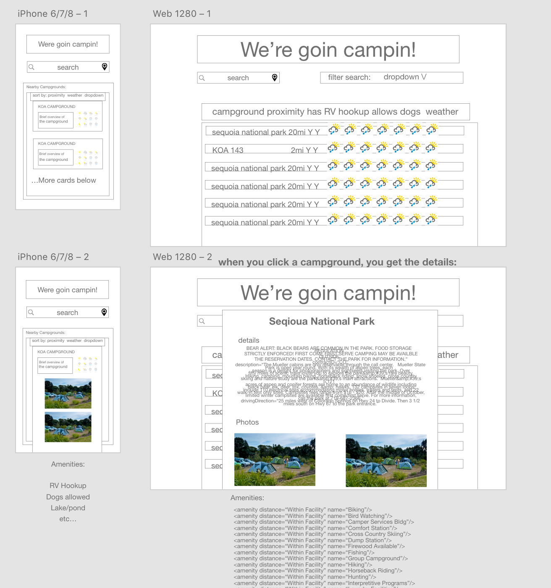
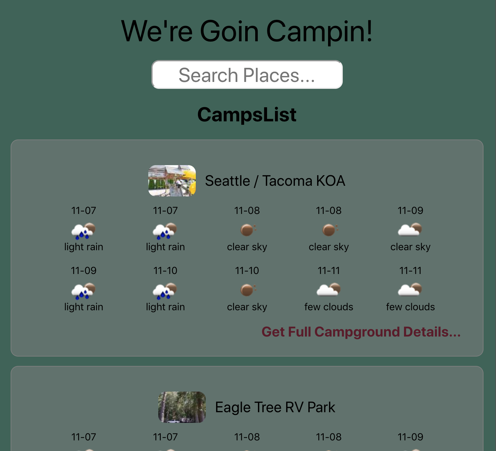
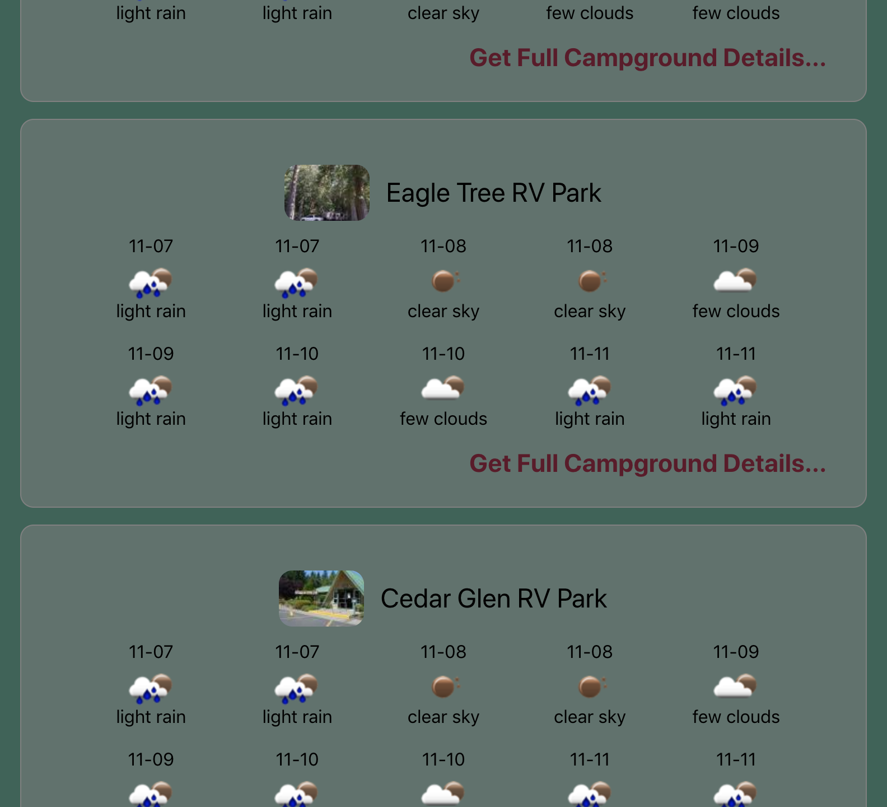
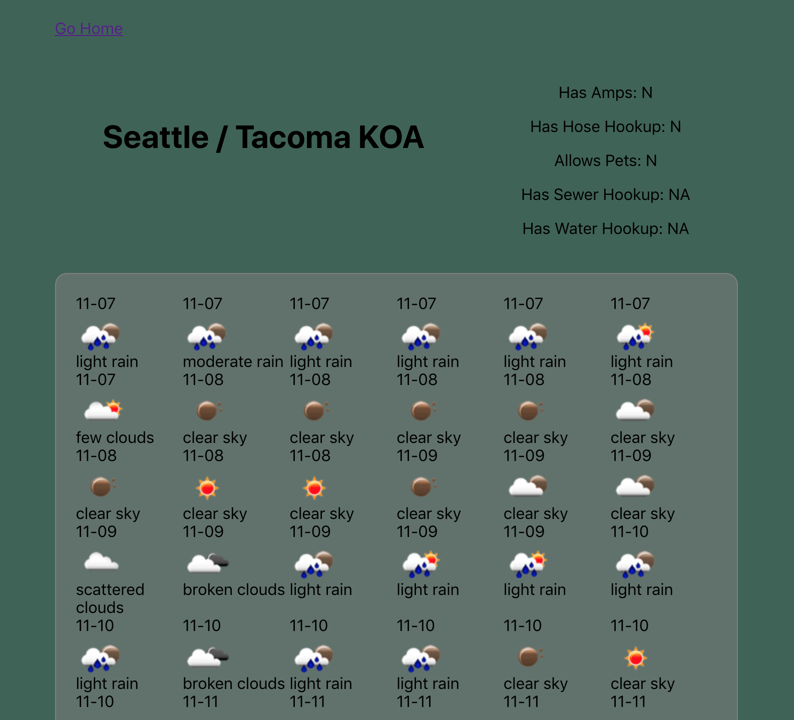

This project was bootstrapped with [Create React App](https://github.com/facebook/create-react-app).

## Get it up and running

In the project directory, run:

### `npm install`
### `npm start`

Runs the app in the development mode. 
Open [http://localhost:3000](http://localhost:3000) to view it in the browser. (press y if localhost:3000 already in use)

The page will reload if you make edits. 

### `npm test`

Runs the test suite. App is thoroughly tested.

## Goin Campin

This app was created as a way to find nearby (or far away) campgrounds that have the best upcoming weather so that you can choose to stay where the sky will be clear.

Goin Campin leverages the openWeatherMap API, as well as the Active Developers campground search. In later iterations, it will also use the REI Hiking Project open API. 

This app showcases use of the following:
 - React
 - Redux
 - Thunk middleware
 - Jest
 - Enzyme
 - CSS Grid
 - CSS Flex
 - OOP
 - TDD

Below are the wireframes used to conceptualize the app, as well as screenshots of the final product:

